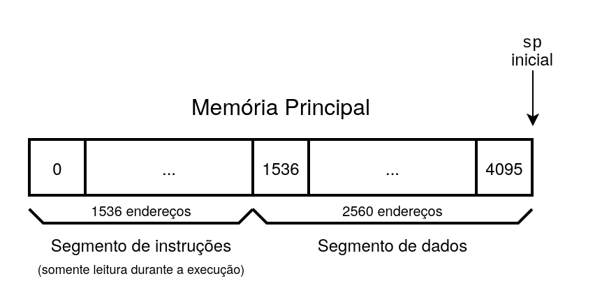
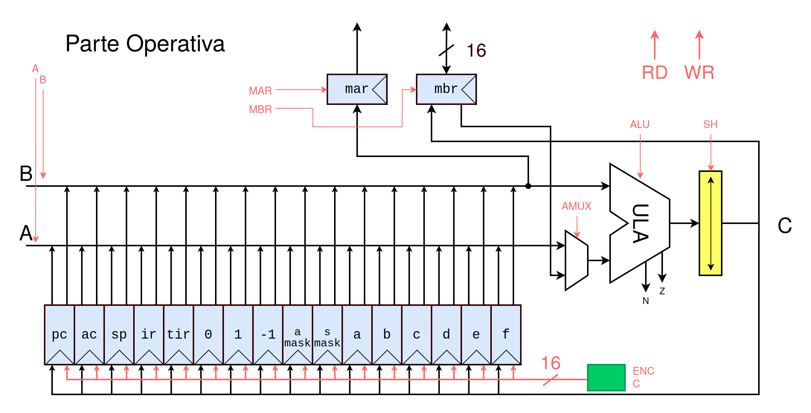
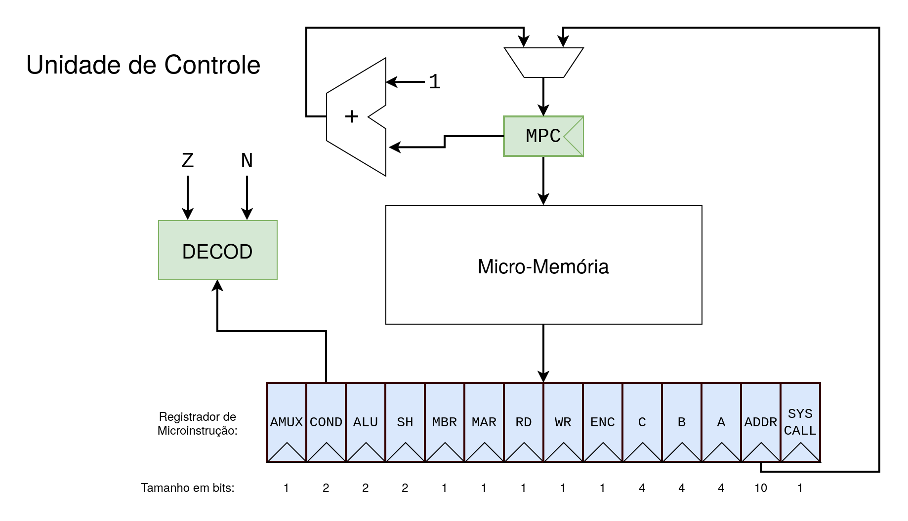
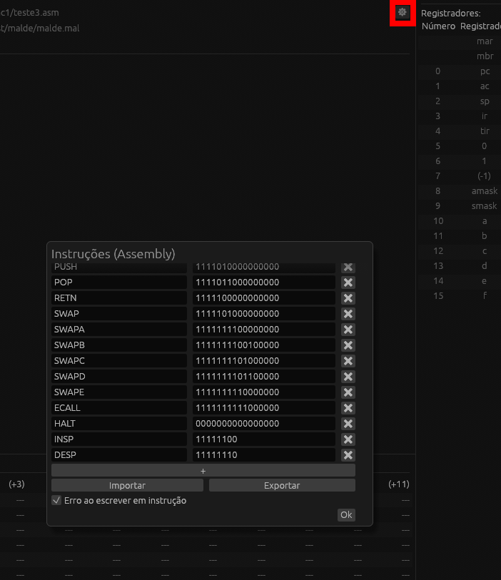

<div align="center">
  
</div>

# MALDE: Micro-Assembly Language Debugging Environment
Malde é um simulador da Micro-Assembly Language da arquitetura MIC-1 Andrew Tanenbaum, com parsers para a linguagem MAL e assembly MAC.

- **Microprograma** (_MAL_): carregado na micro-memória da unidade de controle
- **Macroprograma** (_ASM_): carregado na memória principal

## Recursos
- [Slides de Apresentação](assets/MALDE%20Apresentação.pdf)
- [Microprograma padrão](malde.mal)
- [Instruções padrão](instrucoes.txt)
- [Exemplos](examples/)

## Instalação
### Página de [downloads](https://github.com/henriqueb04/malde/releases/latest)

Se estiver usando Linux, antes de executar é preciso ter as seguintes dependências instaladas: `libGL`, `libxkbcommon`, `wayland`, `zenity`. (Se seu gerenciador de janelas usar X11, pode ser necessário usar `libx11`, `libxcursor`, `libxrandr` e `libxi` em vez de `wayland`)

No MacOS ou Linux, pode ser necessário dar a permissão de execução pro arquivo baixado:

```bash
cd ~/Downloads  # ou a pasta onde você colocou o arquivo
chmod +x ./malde-*
xattr -d com.apple.quarantine malde-macos-arm64  # apenas no MacOS
./malde-*  # executa o arquivo
```

## Tutorial
1. Botões **Escolher arquivo Assembly** e **Escolher arquivo MAL**: Escolhem o caminho para o arquivo de macroprograma e microprograma, respectivamente.
2. Botão _Configurações_ (⚙): Abre a tela de customização de instruções.
3. Botões **Montar microprograma** e **Montar macroprograma**: Leem os arquivos nos caminhos selecionados anteriormente e carregam os programas em suas respectivas memórias.
4. Botão **Executar**/**Pausar**: Executa/pausa todo o macro/microprograma.
5. Botão **Próxima microinstrução**: Executa uma única microinstrução.
6. Botão **Próxima macroinstrução**: Executa todas as microinstruções até que a próxima macroinstrução seja lida da memória.
7. Botões **_Breakpoint_** (checkboxes do lado de cada macro/microinstrução): Quando selecionados, pausam a execução logo antes do programa executar aquela macro/microinstrução.
8. Botão **Resetar**: Reinicia o macro/microprograma.

## Arquitetura MIC-1

### Memória Principal
*   **Capacidade Total:** 4096 endereços.
*   **Segmento de Instruções:** 1536 endereços (0 a 1535). É de leitura apenas (read-only) durante a execução.
*   **Segmento de Dados:** 2560 endereços.
*   **Ponteiro de Pilha (`sp`):** Inicia no final da memória principal.



### Estrutura Interna
*   **Parte Operativa (Caminho de dados):** Contém a ULA (Unidade Lógica e Aritmética) e os registradores do caminho de dados (`pc`, `ac`, `sp`, `ir`, `tir`, `0`, `1`, `(-1)`, `amask`, `smask`, `a` até `f`). 
*   **Acesso à memória:** Controlado por `mar` e `mbr` através dos sinais `RD` (leitura) e `WR` (escrita).
*   **Unidade de Controle:** Utiliza uma micro-memória e um MPC (Micro Program Counter) para ditar os sinais de controle a cada ciclo.



## Micro-Assembly (MAL)



O microprograma gera sinais de controle de 36 bits a cada ciclo, divididos em: `AMUX`, `COND`, `ALU`, `SH`, `MBR`, `MAR`, `RD`, `WR`, `ENC`, `C`, `B`, `A`, `ADDR` e `SYSCALL`.

### Comandos de Controle de Fluxo e Memória
| Comando MAL | Sinais Gerados |
| :--- | :--- |
| `rd` | `rd: 1` |
| `wr` | `wr: 1` |
| `goto RÓTULO` | `addr: RÓTULO`, `cond: 3` |
| `if n then goto RÓTULO` | `addr: RÓTULO`, `cond: 1` |
| `if z then goto RÓTULO` | `addr: RÓTULO`, `cond: 2` |
| `<REG> := <OP>` | `enc: 1`, `c: (REG)` |
| `mbr := <OP>` | `mbr: 1` |
| `mar := <REG>` | `mar: 1`, `b: (REG)` |

### Operações da ULA e Deslocamento
*Sinais das flags `N` (negativo) e `Z` (zero) são calculados antes do deslocamento.*

| Operação MAL | Sinais Gerados |
| :--- | :--- |
| `<A> + <B>` | `a: <A>`, `b: <B>`, `alu: 0` |
| `band (<A>, <B>)` | `a: <A>`, `b: <B>`, `alu: 1` |
| `<A>` | `a: <A>`, `alu: 2` |
| `inv (<A>)` | `a: <A>`, `alu: 3` |
| `lshift (<ULA>)` | `sh: 1` |
| `rshift (<ULA>)` | `sh: 2` |

## Assembly (MAC)

As instruções MAC possuem 16 bits. Algumas instruções são parametrizadas com operandos (X, Y) nos bits menos significativos.

### Instruções Padrão
| Mnemônico | Instrução | Significado |
| :--- | :--- | :--- |
| `LODD X` | `0000xxxxxxxxxxxx` | `AC := M[X]` |
| `STOD X` | `0001xxxxxxxxxxxx` | `M[X] := AC` |
| `ADDD X` | `0010xxxxxxxxxxxx` | `AC := AC + M[X]` |
| `SUBD X` | `0011xxxxxxxxxxxx` | `AC := AC - M[X]` |
| `JPOS X` | `0100xxxxxxxxxxxx` | `If AC >= 0; PC := X` |
| `JZER X` | `0101xxxxxxxxxxxx` | `If AC = 0; PC := X` |
| `JUMP X` | `0110xxxxxxxxxxxx` | `PC := X` |
| `LOCO X` | `0111xxxxxxxxxxxx` | `AC := X` |
| `LODL X` | `1000xxxxxxxxxxxx` | `AC := M[SP +X]` |
| `STOL X` | `1001xxxxxxxxxxxx` | `M[X + SP] := AC` |
| `ADDL X` | `1010xxxxxxxxxxxx` | `AC := AC + M[SP + X]` |
| `SUBL X` | `1011xxxxxxxxxxxx` | `AC := AC - M[SP + X]` |
| `JNEG X` | `1100xxxxxxxxxxxx` | `if AC < 0; PC := X` |
| `JNZE X` | `1101xxxxxxxxxxxx` | `if AC != 0; PC := X` |
| `CALL X` | `1110xxxxxxxxxxxx` | `SP := SP - 1; M[SP] := PC; PC := X` |
| `PSHI` | `1111000000000000` | `SP := SP - 1; M[SP] := M[AC]` |
| `POPI` | `1111001000000000` | `M[AC] := M[SP] SP := SP + 1;` |
| `PUSH` | `1111010000000000` | `SP := SP - 1; M[SP] := AC` |
| `POP` | `1111011000000000` | `AC := M[SP]; SP := SP + 1;` |
| `RETN` | `1111100000000000` | `PC := M[SP]; SP := SP + 1;` |
| `SWAP` | `1111101000000000` | `TMP := AC; AC := SP; SP := TMP` |
| `INSP` | `11111100yyyyyyyy` | `SP = SP + Y` |
| `DESP` | `11111110yyyyyyyy` | `SP := SP - Y` |

### Instruções Adicionais e Customizáveis


É possível criar suas próprias instruções customizando os nomes e códigos de operação.

Essas instruções são incluídas por padrão além das especificadas anteriormente:

| Mnemônico | Instrução | Significado |
| :--- | :--- | :--- |
| `SWAPA` | `1111111100000000` | `TMP := AC; AC := A; A := TMP` |
| `SWAPB` | `1111111100100000` | `TMP := AC; AC := B; B := TMP` |
| `SWAPC` | `1111111101000000` | `TMP := AC; AC := C; C := TMP` |
| `SWAPD` | `1111111101100000` | `TMP := AC; AC := D; D := TMP` |
| `SWAPE` | `1111111110000000` | `TMP := AC; AC := E; E := TMP` |
| `ECALL` | `1111111111000000` | Chamada de sistema (_syscall_) |
| `HALT` | `0000000000000000` | Encerra programa |

## Chamadas de Sistema (Syscalls)

Ocorrem quando o sinal `syscall: 1` é ativado. O valor presente no registrador `ac` indica qual operação será executada, e o retorno (se houver) é salvo de volta em `ac`. Os argumentos são definidos em `a`, `b`, `c`, `d` e `e`.

| Código (AC) | Operação | Argumentos | Retorno (AC) |
| :--- | :--- | :--- | :--- |
| **1** | Print Inteiro | `a` = inteiro a imprimir | - |
| **2** | Print Caractere | `a` = caractere a imprimir | - |
| **3** | Print String | `a` = endereço de memória da string | - |
| **4** | Print Int. (Hex) | `a` = inteiro a imprimir | - |
| **5** | Print Int. (Bin) | `a` = inteiro a imprimir | - |
| **6** | Print Int. (S/ Sinal) | `a` = inteiro a imprimir | - |
| **7** | Ler Inteiro | - | Inteiro lido |
| **8** | Ler Caractere | - | Caractere lido |
| **9** | Ler String | `a` = endereço de destino, `b` = tamanho | Tamanho lido |
| **10** | Encerrar | - | - |
